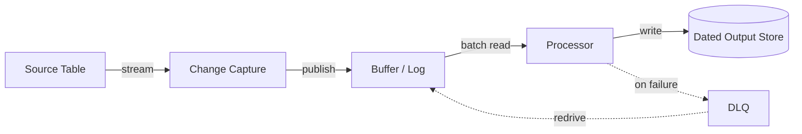

# Real-Time Change-Data-Capture Monitoring Pipeline

A real-time monitoring and audit pipeline for a system that periodically
pauses/resumes a benefit for many entities across many regions, with zero
data loss and full auditability.

## Requirements

**Functional**
- Operators can see, in near real time, when something was paused,
  resumed, or expired for a given item.
- Analysts can query historical pause/resume/expire events per region and
  per program.
- On-call engineers can reprocess any event that failed to make it into
  the audit trail.

*Below the line:* support multiple programs sharing the same pipeline;
support replaying back-dated events.

**Non-functional**
- **Zero data loss** — every state change must eventually land in the
  audit store, even under downstream failure.
- **Near-real-time** — visible within a couple of minutes, not next-day
  batch.
- **Cheap to run continuously** — a background system, not the primary
  money path, so cost matters more than p99 latency.
- Eventually-consistent visibility is fine; losing an event is not.

*Below the line:* multi-region; retention window on raw records.

Volume is bounded by the number of tracked entities, not raw customer
traffic — no need for write sharding, stream-scale throughput is enough.

## Input / Output & Data Flow

**Input:** item-level changes (insert / modify / remove) on a source
table that tracks each entity's current pause/resume schedule.

**Output:** an append-only, dated record per state change — which
entity, which program, what happened (activated / deactivated /
expired), and when.

1. Source table changes stream out as they happen.
2. A processor classifies each change into an event type based on which
   fields changed.
3. The processor writes a normalized record to durable storage,
   partitioned by date.
4. Anything that fails to process is captured separately, not dropped.

## High-Level Design

**Change-capture stream** — *What:* emits an ordered record for every
item-level write on the source table. *Why over polling:* polling at a
useful interval either misses changes between polls or costs more read
capacity than the writes did; a stream gives every change exactly once,
in order. *When it breaks down:* it's not a backfill mechanism — you
only get changes from after the stream was turned on.

**Buffering log (Kinesis-style)** — *What:* sits between the
change-capture stream and the processor, holding records for a retention
window. *Why:* decouples produce rate from consume rate, and — the real
reason it matters here — lets you replay a window if the processor was
down or buggy. *When you wouldn't need it:* if the processor could never
fall behind (it can, since it's Lambda-based and can throttle).

**Stream processor (Lambda-style)** — *What:* reads batches, decodes
them, classifies the event type from which fields are present, writes a
normalized record. *Why Lambda over a long-running consumer:* the
workload is bursty and event-driven, not steady-state; pay-per-invocation
fits. *When you'd switch:* sustained high throughput would favor a
long-running consumer to avoid cold-start and per-invocation overhead.

**Partitioned output store (date-partitioned object storage)** — *What:*
durable landing zone, queryable by analysts. *Why partition by date:*
query patterns are almost always "what happened on/around day X." *When
it breaks down:* if the pattern shifted to "all history for entity X,"
you'd need a secondary index, not just date partitions.

## Deep Dives

Why these three: they're the three places this kind of pipeline actually
breaks — partial batch failure, poison-pill records, and "we thought it
was real-time but it's actually stuck."

### 1. What happens when one record in a batch fails to process?

**Simple approach:** fail the whole batch, let the buffer redeliver it.
Sufficient? No — one malformed record now blocks every good record
behind it, and you get stuck reprocessing the same bad record forever.

**Better approach:** report partial batch failure — process every
record independently, collect which sequence numbers failed, and only
ask the buffer to redeliver those. New problem: the failed records still
need a home once retries are exhausted — that's the next dive.

**What I'd pick:** partial batch failure reporting, because full-batch
retry turns one bad record into unbounded reprocessing of good ones.

### 2. Where do exhausted-retry records go, and how do you get them back in?

**Simple approach:** drop them, rely on next-day reconciliation.
Sufficient? No — violates zero-data-loss outright, and manual
reconciliation is slow and error-prone.

**Better approach:** a dead-letter queue captures the failed record with
enough context to reconstruct it, and a deliberately manual redrive tool
lets an engineer push it through the processor again. New problem: if
the buffer's retention window expires before someone triages the DLQ,
the record is unrecoverable from the stream. Mitigation: store the raw
payload directly in the DLQ message so recovery doesn't depend on stream
retention at all.

**What I'd pick:** DLQ with the raw payload embedded — removes the
retention-window race entirely.

### 3. How do you know the pipeline is actually keeping up?

**Simple approach:** alert on processor error rate. Sufficient? No — a
processor that's healthy but slow (rising iterator age) produces zero
errors while quietly becoming less real-time.

**Better approach:** alarm on consumer iterator/offset age directly,
plus DLQ depth as a leading indicator of a recurring bad-record type.

**What I'd pick:** iterator-age as the primary signal, DLQ depth as
secondary — error rate alone is the metric most likely to look green
while the system stops being real time.

## Wrap-Up

Final flow: same as above, DLQ and redrive folded in as the
async/failure branch alongside the main stream → processor → store
path.

With more time: a reconciliation job that periodically diffs
source-table state against the output store; support multiple programs
on one pipeline via a program field instead of per-program
infrastructure; revisit whether the output store needs an access
pattern beyond "by date."
