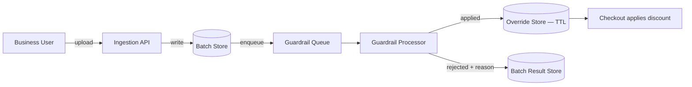

# Promotional Override System with Guardrails

A system that lets a business team manually apply larger, targeted
promotional discounts than an automated program allows — safely, with
abuse protection and automatic expiration.

## Requirements

**Functional**
- Business users can submit a batch of items with a target discount and
  have it applied automatically if eligible.
- The system rejects or excludes any item that fails a safety check —
  never silently approves it.
- Discounts expire automatically without manual cleanup.

*Below the line:* custom expiration window per batch; early removal of
an override.

**Non-functional**
- **Bounded financial exposure** — a single batch can't spend an
  unbounded amount before anyone notices.
- Eligibility checks can be eventually consistent (a few minutes of
  staleness on "is there a competing offer" is fine); a hard guardrail
  like a max-discount cap must never be violated.
- **Auditable** — every accept/reject needs a reason, since this touches
  real spend.

*Below the line:* throughput — this is a business-tool workload
(batches, not per-request customer traffic).

## Entities & API

**Entities**
- **Override Batch** — uploaded items, target discount, expiration
  window.
- **Override Record** — one item's decision (applied / rejected +
  reason) and its expiration timestamp.

**API**
- `POST /overrides` — submit a batch. Returns a batch ID.
- `GET /overrides/{batchId}` — poll per-item results (async processing,
  not synchronous per item).

REST, since this is an internal tool with a natural request/response
shape, not a stream.

## High-Level Design

**Ingestion** — *What:* accepts the batch, writes it durably, hands it
to a queue for async processing. *Why async:* checking every item
against every guardrail can take longer than a request timeout is
worth — bundling it into one HTTP request makes the whole batch as slow
as the slowest check.

**Guardrail processor** — *What:* independently evaluates every
hard-coded safety rule per item (discount within cap, basic eligibility,
no better organic price already exists, no conflicting existing offer)
before creating the discount. *Why check every rule rather than
short-circuit on first failure:* an auditable business tool needs
"rejected: exceeds cap AND has a competing offer," not just the first
failure found.

**Auto-expiring store** — *What:* every applied override carries a TTL.
*Why TTL over a cron cleanup job:* close to free, can't be forgotten to
run. *When you'd need the cron job anyway:* if "expire" needs a side
effect beyond deletion (e.g. a notification) — TTL alone can't trigger
that.

Rejecting unsafe items is covered by the independent per-rule guardrail
processor above; a new rule is additive, not a rewrite. Automatic
expiration is covered by the TTL-based override store.

## Deep Dives

Why these three: the interesting risk in "let a human bypass automated
guardrails" isn't the happy path — it's gaming, staleness, and scale.

### 1. How do you stop runaway spend from repeated orders on one item?

**Simple approach:** rely on the per-item discount cap. Sufficient? No —
a cap per item says nothing about volume; a popular item can generate
outsized spend in a short window even at a modest per-unit discount.

**Better approach:** pair a per-checkout quantity limit with a
demand-spike detector watching order velocity on overridden items
specifically. New problem: a spike detector needs a baseline, and a
legitimately popular item spikes too — so it needs to be a
human-reviewable alert, not an automatic shutoff.

**What I'd pick:** quantity limit as the hard always-on guardrail, spike
detection as a paging signal — auto-reverting on a false positive kills
a legitimately successful promotion.

### 2. What if the world changes after a guardrail check passes but before the discount is used?

**Simple approach:** check eligibility once, at creation time.
Sufficient much of the time given a bounded window — but not if
something true at creation stops being true partway through.

**Better approach:** re-evaluate item-level guardrails on a schedule (or
on the specific events likely to invalidate them) and pull the override
the moment a hard guardrail is violated. Real complication: not every
upstream system reliably notifies on the relevant change — some
notification paths intentionally filter "boring" changes to save cost,
so an invalidating change can slip through undetected until natural
expiration. Mitigation: keep the default expiration window short, which
bounds how long a missed re-check can matter.

**What I'd pick:** scheduled re-checks plus a short default TTL — you
can't make the notification path fully reliable without owning every
upstream system, so bounding blast radius is the more dependable lever.

### 3. How do you keep this safe as batch submission scales up?

**Simple approach:** no pre-selection, process whatever's submitted.
Sufficient? No — puts all the safety burden on the guardrail processor
after the fact, and a badly-scoped batch wastes processing.

**Better approach:** pre-selection filters before a batch is even
accepted — has this item had a recent override and how much was spent,
does the submitter have a history of overly broad batches, is inventory
low enough to naturally cap exposure.

**What I'd pick:** pre-selection as a first-pass filter, not a
replacement for the guardrail processor — it's a coarser, cheaper
signal, so the authoritative check still has to happen per-item at
processing time.

## Wrap-Up

Final flow: ingestion → batch store → guardrail queue → guardrail
processor → TTL-backed override store, with a parallel scheduled
re-check path and a monitoring path watching order velocity.

With more time: make the rule set data-driven instead of code so a new
rule doesn't need a deploy; add a "simulate" mode showing what a batch
would do without applying anything; reuse pre-selection scoring to
prioritize which batches a human reviewer sees first.
