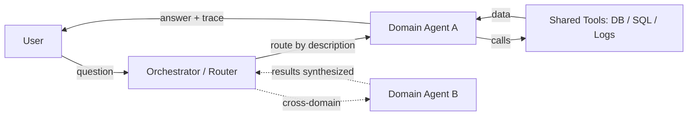

# Multi-Tenant AI Agent Platform with Shared Tooling

A platform letting many teams each stand up their own AI assistant for
operational tasks, without each team rebuilding the same data-access
plumbing.

## Requirements

**Functional**
- A user asks an operational question in natural language and gets an
  answer grounded in real data, not the model's own guess.
- A new team can onboard their own assistant without writing new
  infrastructure — only domain knowledge and access scope.
- A question touching more than one team's domain routes to (or
  synthesizes across) the right assistants.

*Below the line:* cross-turn conversation memory; a UI beyond simple
chat.

**Non-functional**
- **Strict data isolation between teams** — one team's assistant must
  never read another team's data, even if it tries.
- **Read-only by default** — an investigation tool, not a system that
  mutates production state.
- Marginal cost of onboarding a new team should be small (days, not
  months) — that's the entire point of the platform.

*Below the line:* p99 latency (a multi-step investigation under a
minute is fine); anything on the write path, out of scope.

## Entities & API

**Entities**
- **Agent** — one team's assistant: name, description (used for
  routing), access scope, and a set of domain-specific skills.
- **Skill** — a step-by-step procedure (what to query, in what order,
  how to interpret it) for one class of question.
- **Tool** — a generic, domain-agnostic capability (query a store by
  key, run SQL, search logs) any agent can call.

**API**
- `POST /ask` — `{ question, optional agentName }` → routes to the
  right agent (or the one specified), returns an answer with its
  reasoning trace.

Single entry point rather than one endpoint per team, since routing is
the point of the platform.

## High-Level Design

**Orchestrator / router** — *What:* the single entry point; reads each
registered agent's name/description and picks which agent(s) should
handle the question. *Why description-based routing over a hardcoded
rule table:* a rule table needs a code change per team and doesn't scale
past a handful of teams; letting a model read short descriptions scales
to N teams with zero routing-code changes per team. *When it breaks
down:* routing quality is only as good as how well a team wrote its
description.

**Domain agent** — *What:* a per-team process that receives the routed
question, picks which of its skills applies, and executes it by calling
tools. *Why one agent per team rather than one shared agent with
per-team config:* isolation — a bug or runaway loop in one team's logic
can't touch another team's runtime.

**Shared tool layer** — *What:* a small, fixed set of generic
capabilities (query a table by key, run SQL, search logs by
pattern/time range) every agent calls the same way, only the target
table/database/log group differs. *Why generic tools instead of
per-team query code:* the access pattern is identical across teams —
building it once and parameterizing it avoids N nearly-identical
implementations. *When a team needs more:* they register their own tool
the same way — nothing forces everything through the generic set.

**Skill (domain-specific SOP)** — *What:* a short, deliberately
prescriptive procedure — exact tables, exact steps, exact output
format — the agent follows rather than improvising. *Why prescriptive:*
less room to improvise is less room to hallucinate a
plausible-but-wrong root cause, which matters far more here than in a
general chat assistant.

Onboarding a new team without new infrastructure is covered by the
shared tool layer: a team supplies only access scope + 3–5 skills;
runtime, tools, UI, and routing are all inherited. Routing or
synthesizing across domains is covered by the orchestrator above.

## Deep Dives

Why these three: the platform's value rests on isolation actually
holding, routing actually working as team count grows, and the model
not confidently making things up.

### 1. How do you guarantee one team's agent can never read another team's data, even with a bug in its own logic?

**Simple approach:** trust the agent's code to only query its own
tables. Sufficient? No — that puts a security boundary inside
application logic, exactly the kind of boundary a bug or bad prompt can
cross.

**Better approach:** enforce isolation at the infrastructure layer —
each agent runs under its own least-privilege execution role, scoped to
only its own team's tables/logs, via temporary assumed credentials. The
tools are generic and don't know which team is calling; the caller's
permissions are what actually gate access.

**What I'd pick:** role-based enforcement over application-level
checks — it holds even if every line of the agent's own code is wrong.

### 2. How does routing stay accurate as teams grow from 3 to 30?

**Simple approach:** show the router every agent's full description.
Sufficient at small scale? Yes — forever? No — descriptions start
overlapping, the prompt gets long, accuracy degrades in ways that are
hard to debug from outside.

**Better approach:** treat agent descriptions as a routing artifact
reviewed and tested for accuracy before onboarding, plus a
direct-address bypass so a user who already knows which team they need
can skip routing entirely. New problem: a bypass only helps if the user
knows the agent exists, pushing some discovery burden back to the user.

**What I'd pick:** description-quality review as policy plus a bypass
as the safety valve — the actual failure mode at scale is
ambiguous/overlapping descriptions, which no router alone fully
resolves.

### 3. How do you keep the agent from confidently reporting a wrong root cause?

**Simple approach:** trust the model's answer. Sufficient? No —
occasionally confidently wrong is worse than honestly uncertain, because
people act on a confident wrong answer.

**Better approach:** prescriptive skills (limits improvisation) plus
always showing the full reasoning trace so the user validates before
acting.

**What I'd pick:** prescriptive skills plus mandatory trace visibility,
and treat root-cause accuracy on a real scenario set as a rollout
gate — a new agent doesn't go to broad usage until it clears an
accuracy bar.

## Wrap-Up

Final flow: same as above, isolation boundary drawn explicitly at the
role layer around each agent, reasoning trace shown alongside every
answer.

With more time: move routing from wherever it's cheapest to prototype
into a proper backend service once more than a couple of agents are
live, since routing/access decisions belong server-side; add usage
metrics and per-answer feedback to catch accuracy regressions early;
consider gated write actions and what confirmation/audit that would
need.
