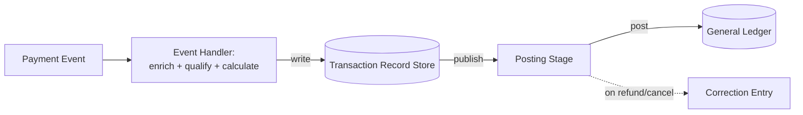

# Automated Financial Ledger Reconciliation System

A system that automatically posts accounting entries for a promotional
cost a third party is funding, ensuring the cost lands on the correct
internal ledger, with automatic correction when the underlying
transaction changes.

## Requirements

**Functional**
- Automatically calculate and post the correct fee for every qualifying
  transaction, no manual entry.
- Entries self-correct when the underlying transaction changes (refund,
  cancellation).
- Onboarding a new funding partner shouldn't require rebuilding
  calculation or posting logic.

*Below the line:* a browsing UI for finance; historical backfill.

**Non-functional**
- **Correctness is the entire point** — entries must be accurate and
  idempotent (never double-posted, never lost), not just fast.
- Eventually consistent timing is fine (same-day, not same-millisecond);
  exactly-once outcome is not negotiable.
- **Auditable** — every entry traceable back to the transaction that
  caused it.

*Below the line:* throughput — bounded by real transaction volume, not
something needing independent scaling.

## Input / Output & Data Flow

**Input:** a payment/order lifecycle event (authorized, captured,
refunded, cancelled) for a transaction that may be eligible for
third-party-funded, zero-cost financing.

**Output:** a balanced accounting entry (debit + credit) posted to the
general ledger, tagged to the correct cost center, with automatic
correction entries when the transaction later changes.

1. A payment event arrives.
2. The system enriches it with order/shipment context needed for
   eligibility.
3. It checks eligibility and calculates the fee using partner-specific
   but structurally identical logic.
4. It persists an internal transaction record capturing the
   calculation.
5. A second stage consumes that record and posts the ledger entries.
6. If the transaction later changes, the same flow produces a
   correcting entry rather than a fresh unrelated one.

## High-Level Design

**Event handler stage** — *What:* consumes the lifecycle event,
enriches it via order/shipment context, calculates the fee with a
shared calculation core parameterized by partner-specific inputs (rate,
fee model). *Why a shared core over per-partner implementations:* the
calculation is structurally identical across partners — one calculator
taking partner config as a parameter avoids N nearly-identical
implementations. *When you'd break that:* a structurally different fee
model would cost more to force into the shared calculator than to write
separately.

**Transaction record store** — *What:* durable, idempotent record of
"this transaction, this calculation, this state." *Why persist an
intermediate record instead of calculate-and-post in one step:*
separating "figure out what happened" from "post it" means a posting
failure can retry against the stored calculation instead of
recalculating against possibly-changed upstream data.

**Posting stage** — *What:* reads the transaction record, posts a
balanced double-entry to the general ledger. *Why decouple via async
messaging rather than one synchronous call chain:* the two stages have
different failure and retry needs — a posting failure shouldn't force
redoing the (potentially expensive) enrichment and eligibility work.

Auto-correcting on transaction change is covered by the transaction
record store: a refund/cancel event runs through the same flow and,
keyed to the same transaction, produces a correction instead of an
unrelated entry. Onboarding a new partner without rebuilding logic is
covered by the shared calculation core: a new partner is config (rate,
fee model), not code.

## Deep Dives

Why these three: money-movement systems fail in specific,
boring-but-critical ways — double-posting, wrong cost-center routing,
and correction entries drifting apart.

### 1. How do you guarantee a transaction is never posted twice, even if the event handler retries after a partial failure?

**Simple approach:** rely on at-least-once delivery, hope duplicates are
rare. Sufficient? No — "rare" isn't good enough on a general ledger; a
duplicate posting is a real accounting error.

**Better approach:** make posting idempotent by keying every entry to a
deterministic identifier derived from the transaction and its
state/version, so retrying the same event produces the same entry, not
a second one. New problem: the key needs to distinguish a legitimate
correction (a real new state) from an accidental retry of the same
state — so it has to include transaction ID plus state version.

**What I'd pick:** idempotency keyed on transaction ID + state
version — the only approach that lets corrections through while
blocking accidental duplicate posting of the exact same state.

### 2. How do you make sure cost lands on the correct internal cost center, not the default one?

**Simple approach:** post everything to one general cost center, let
finance reclassify manually. Sufficient? That's close to the state this
system exists to replace — doesn't scale.

**Better approach:** carry enough context through the pipeline (product
line, funding type) to route to the correct segment automatically at
posting time, via an explicit mapping table rather than inferred logic.
New problem: that mapping table has to stay in sync with how the
business organizes its ledger segments, which changes over time and
isn't engineering's call — it needs to be a reviewable config change,
not a deploy.

**What I'd pick:** an explicit, externally-editable mapping table over
inferred routing — ledger segment ownership is a finance decision, and
coupling it to a deploy makes routine reclassification unnecessarily
slow.

### 3. How do correction entries stay in sync across multiple state changes?

(captured, then partially refunded, then fully refunded)

**Simple approach:** post one correction per state change, calculated
independently each time. Sufficient? No — independently-calculated
corrections can drift from each other if rate or eligibility is ever
re-evaluated differently between events, leaving the ledger's net
effect inconsistent with reality.

**Better approach:** always calculate corrections as a delta against
the original recorded transaction state, not independently against
current state — the transaction record store is what makes this
possible.

**What I'd pick:** delta-against-original rather than independent
recalculation — independent recalculation is the specific thing that
lets two corrections for the same transaction quietly disagree.

## Wrap-Up

Final flow: same two-stage flow, correction/refund path shown as a
variant of the same flow rather than separate infrastructure.

With more time: a reconciliation job comparing ledger totals against the
source transaction system to catch drift the idempotency logic missed;
version the mapping table so a historical entry is always explainable
by the mapping as it existed on that date; evaluate whether a
structurally different fee model is common enough to warrant a second
calculation path.
