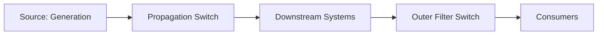

# Phased, Reversible Deprecation Framework

A way to safely stop generating and serving a computed signal that many
unknown downstream systems might depend on, without breaking any of them
and without a slow, all-or-nothing cutover.

## Requirements

**Functional**
- An operator can stop a specific signal from being generated, without
  affecting any other signal.
- The system supports stopping consumption before stopping generation,
  so nothing breaks if a consumer wasn't accounted for.
- Every step is instantly reversible without a code deploy.

*Below the line:* automatic discovery of every consumer (assume a
best-effort audit, not perfect knowledge).

**Non-functional**
- **Zero disruption** to consumers of signals that are *not* being
  deprecated — must be precisely scoped, not a blunt on/off switch.
- Reversibility has to be fast (seconds to minutes via config).
- **Auditable:** which signal, which phase, when, and why, reconstructable
  after the fact.

*Below the line:* throughput/latency — an operational safety framework,
not a hot-path optimization.

## Input / Output & Data Flow

**Input:** a decision that a specific computed signal, for a specific
scope (e.g. one market), should stop being generated.

**Output:** the signal is fully removed from generation, zero observed
impact to consumers of every other signal, with a documented instant
path back if something was missed.

Three phases, in order:
1. Stop the signal from being returned to callers at the outermost
   layer, while still generating and propagating it internally.
2. Once phase 1 is validated with no consumer impact, stop propagating
   the signal downstream, while still generating it at the source.
3. Once phase 2 is validated, stop generating the signal at the source
   entirely.

## High-Level Design

**1. Stop consumption first, without touching generation**

**Outer-layer filter switch** — *What:* a config-driven filter at the
layer closest to the consumer (an API responder, a reactive precompute
stage) that removes the deprecated signal from what's returned, scoped
to signal + market. *Why filter at the outermost layer first:* smallest
blast radius, fastest/cheapest rollback — undoing one config flag, not
unwinding generation logic. *Why config-driven, not a code path:* phase
1's entire point is instant reversibility.

**Backfill-on-rollback mechanism** — *What:* if phase 1 rolls back,
affected records need their latest correct values force-propagated to
any reactive downstream caches, not left to expire naturally. *Why:* a
reactive/precompute layer only re-fires on the next change — if nothing
changes after rollback, stale data sits indefinitely.

**2. Stop propagation once consumption is proven safe**

**Propagation-layer filter switch** — *What:* a second, independent
switch one layer further upstream, excluding the deprecated signal from
what's published downstream while the source keeps generating it. *Why
a second switch instead of extending phase 1's scope:* phases need
independent rollback — if propagation filtering causes an unrelated
problem, you roll back only phase 2.

**Delete-path exemption** — *What:* on-delete events for the deprecated
signal are still published unfiltered, even though on-add/update events
are filtered. *Why:* filtering deletes would leave stale records
sitting in downstream systems forever instead of being cleaned up.

**3. Stop generation at the source, last**

**Source-level config removal** — *What:* remove the deprecated signal
from generation config (a membership check), rather than adding an
if/else branch in calculation code. *Why config-membership over a code
branch:* reversal is "add the entry back," not "revert and redeploy,"
and it generalizes to any future signal.

Phase 3 disables the leftmost switch (Generation), Phase 2 the middle
switch (Propagation), Phase 1 the rightmost switch (Outer Filter).
Rollback runs the opposite direction: disable Phase 1 first if anything
looks wrong — source generation is the last thing ever touched, in
either direction.

## Deep Dives

Why these three: the design exists to answer "how do we do this without
knowing every consumer for certain" — so the dives are about validating
safety, handling the consumer nobody knew about, and how long to wait.

### 1. How do you validate a phase is safe before moving to the next, given you can't be certain you found every consumer?

**Simple approach:** ship the filter enabled, watch error-rate alarms.
Sufficient? Partially — catches consumers that break loudly, not one
that silently starts returning wrong-but-plausible results (treating
"missing signal" as zero instead of erroring).

**Better approach:** enable the filter in a lower-risk environment
first and diff outputs (filtered vs. unfiltered) directly, to catch
behavior differences before any real consumer is affected. In
production, roll out gradually starting with a low-volume scope, and
treat each known dependent system's explicit confirmation as a
go/no-go gate, not just an absence of alarms. New problem: gradual,
gated rollout takes real calendar time, and getting each dependent team
to confirm is a coordination cost, not an engineering one — often the
actual bottleneck.

**What I'd pick:** direct output diffing pre-production plus an
explicit sign-off gate per dependent system in production — the risk
here isn't "does the code work," it's "did we miss a consumer," and
only an explicit gate closes that gap.

### 2. What do you do about the consumer you genuinely didn't know about, who shows up after generation has already stopped?

**Simple approach:** treat the audit as complete, move forward.
Sufficient? Only if the audit really is complete — optimistic for a
signal that's existed for years across many teams.

**Better approach:** keep every phase's rollback fast and blame-free (a
config flip, not "figure out who broke it first"). For phase 3
specifically, make rollback fully automatic — flip the config,
generation resumes on its own, since nothing was ever missing from
storage, just not recomputed. For phases 1 and 2, pair rollback with
the backfill/force-propagate mechanism.

**What I'd pick:** design every phase around "assume someone will show
up late" rather than "assume the audit was complete" — the three-phase
structure with independent switches is really a hedge against exactly
this. Treat a late-discovered consumer as an expected, non-emergency
event with a known runbook, not an incident — panicked rollback under
time pressure is when mistakes happen.

### 3. How long should you wait between phases before calling it validated?

**Simple approach:** a fixed short window (e.g. a day). Sufficient? Not
always — some consumers only run on a weekly/monthly cadence (a report,
a batch job), and a short window won't surface them.

**Better approach:** size the validation window to the slowest known
consumer's access pattern rather than a fixed default, and extend it
further for anything accessed via a query interface, where "no error"
doesn't mean "no one queried it."

**What I'd pick:** pattern-informed windows per phase rather than one
fixed number — a fixed short window optimizes for calendar time at the
exact moment the requirement is confidence, not speed.

## Wrap-Up

Final flow: same three independently-reversible switches, phases
1→2→3 for rollout, reverse for rollback, each gated on an explicit
validation step rather than a timer alone.

With more time: build this as a genuinely reusable framework (a generic
"phased, switch-controlled deprecation" pattern with a config schema)
rather than a one-off, since the next deprecation shouldn't rebuild the
same structure from scratch; add tooling that makes "who currently
consumes this" easier to audit up front, to shrink how much the
framework has to hedge against unknown consumers.
