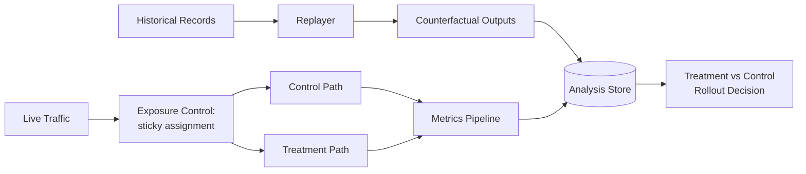

# Experimentation Framework for Evaluating a Pricing-Logic Change

A system to test whether a proposed change to pricing or ranking logic
actually improves outcomes before rolling it out broadly — covering both
offline replay against historical data and live controlled experiments.

## Requirements

**Functional**
- Engineers can propose a logic change and see what it *would have* done
  against historical data, without touching production.
- Engineers can run a live, controlled experiment comparing a new
  treatment against current production behavior on a subset of real
  traffic.
- Analysts can compare treatment vs. control on the business metrics
  that actually matter (conversion, margin, purchase rate), not just
  technical metrics.

*Below the line:* automatic statistical significance calculation;
multi-armed bandit-style traffic allocation.

**Non-functional**
- **Zero impact to production traffic** from replay-based evaluation —
  it has to be fully isolated from anything customer-facing.
- **Exposure control** for live experiments — a customer sees one
  consistent treatment for the duration of the test, not flip between
  variants.
- **Repeatable** — this needs to become a framework future changes
  reuse, not a one-off analysis.

*Below the line:* real-time experiment results; sample-size/power
calculations before launch.

## Input / Output & Data Flow

**Input:** a candidate logic change (new weights/rules) and either a
window of historical decision data, or a live traffic scope to test on.

**Output:** for offline replay — a comparison of what the new logic
would have produced vs. what actually happened, on the same historical
inputs. For a live experiment — treatment vs. control behavior over the
experiment window.

1. A candidate logic change is registered as a "treatment."
2. **Offline path:** historical decision records are replayed through the
   treatment logic, producing counterfactual outputs alongside the real
   historical outputs.
3. **Online path:** incoming live traffic is split into control/treatment
   groups with sticky assignment (same customer always sees the same
   group).
4. Both paths write outcomes to an analysis store, keyed by treatment ID.
5. Analysts query treatment vs. control on business metrics before a
   rollout decision is made.

## High-Level Design

**Historical data replayer** — *What:* reads a window of past decision
records and re-runs them through the proposed treatment logic. *Why
replay real historical inputs rather than synthetic test data:* the
actual distribution of real inputs is what you're deploying against —
synthetic data risks missing edge cases. *When it's not enough on its
own:* replay only tells you what *would* have happened to historical
decisions — it can't capture how customers would have *reacted
differently* to a different outcome, so it's necessary but not
sufficient.

**Isolated execution** — *What:* the treatment logic runs in a separate,
read-only path that never writes back to production systems. *Why:* the
entire value of replay depends on zero blast radius.

**Exposure control (A/B-test style)** — *What:* assigns each customer to a
group with sticky, deterministic assignment based on a stable
identifier, so a customer stays in the same group for the test's
duration. *Why deterministic rather than random-per-request:* a customer
flipping between groups mid-session makes the comparison meaningless.

**Metrics pipeline** — *What:* aggregates business outcomes per group
over the experiment window. *Why business metrics, not just "did the
logic run correctly":* a change can be technically correct and still be
the wrong business call.

## Deep Dives

Why these three: the two evaluation modes answer different questions, and
the two failure modes worth digging into are choosing between them and
making sure the comparison is actually fair.

### 1. When is offline replay sufficient, and when do you escalate to a live experiment?

**Simple approach:** always go straight to a live experiment, since it's
the ground truth. Sufficient? Accurate, but expensive — it exposes real
customers to something unproven and burns limited experiment slots.

**Better approach:** use replay first as a cheap, zero-risk filter — if
a treatment performs clearly worse than production on the same
historical inputs, kill it before ever exposing a real customer. Only
promote treatments that clear replay to a live experiment. New problem:
replay can't detect a treatment that looks fine historically but changes
customer *behavior* in a way that wasn't observable in the historical
record — so a treatment can pass replay and still fail live.

**What I'd pick:** replay as a mandatory gate before any live
experiment, not a replacement for it — cheap enough to run on every
candidate, and catches a large fraction of bad treatments before they
cost a live traffic slot.

### 2. How do you make sure a live experiment's comparison is actually fair?

**Simple approach:** split traffic 50/50 by random request. Sufficient?
No — per-request randomization means the same customer can land in
different groups on different requests, breaking attribution.

**Better approach:** assign the group deterministically from a stable
identifier (hash of a customer ID) so the same customer always lands in
the same group. New problem: sticky assignment means the assignment
logic itself needs to be a pure function of the identifier, not
something computed once and cached in a way that can drift.

**What I'd pick:** deterministic hash-based assignment — it's sticky
without requiring a stored group-membership record per customer; the
assignment is always re-derivable from the same inputs.

### 3. How do you keep this reusable for the next logic change?

**Simple approach:** write custom replay and analysis code per change.
Sufficient? Works once, but every future change repeats the same
plumbing with slightly different glue code.

**Better approach:** standardize the treatment interface (a function
taking the same inputs as production, returning a decision), the
metrics set, and the comparison query — so a new candidate plugs into
existing infrastructure rather than getting bespoke tooling.

**What I'd pick:** a standard treatment interface — the actual
differentiator between candidate changes is the logic itself, not the
plumbing around evaluating it.

## Wrap-Up

Final flow: offline replay as the first gate, live controlled experiment
as the second, both writing to a shared analysis store compared on the
same business metrics before a rollout decision.

With more time: build a lightweight significance/confidence calculation
into the metrics pipeline; support running multiple treatments
concurrently against different traffic slices; extend the standard
treatment interface to more categories of logic changes.
