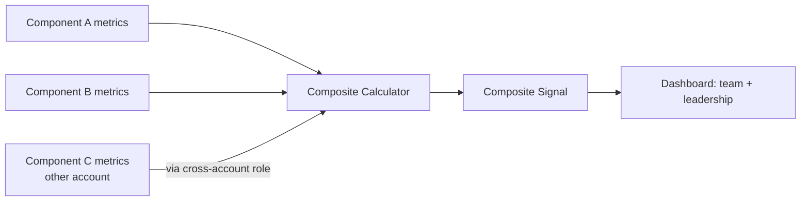

# Composite Health Signal Across a Cross-Account System

A single, trustworthy health/availability signal for a system whose
critical components are spread across multiple accounts/environments,
including one that lives entirely outside the main account.

## Requirements

**Functional**
- An engineer or leader can look at one number/dashboard and know "is
  this system healthy right now," instead of checking several
  disconnected dashboards.
- The signal includes a component that runs in a separate
  account/environment from the rest of the system.
- The signal breaks down by component when something's wrong, not just
  a single opaque number.

*Below the line:* automatic root-cause diagnosis; predictive/anomaly
detection.

**Non-functional**
- The composite signal must reflect **true end-to-end health**, not just
  "is each piece technically running" — a component that's up but
  returning errors should count as unhealthy.
- Cross-account access needs to be secure and least-privilege, not a
  shared credential.
- The signal needs to be trustworthy enough that people actually rely on
  it instead of falling back to checking each piece manually.

*Below the line:* sub-second freshness — a signal a minute or two stale
is fine for this use case.

## Entities & API

**Entities**
- **Component** — one piece of the system being measured, with its own
  success/error metrics.
- **Composite Signal** — the combined health calculation across all
  components, at a point in time.

**API**
- `GET /health` — returns the current composite signal plus a
  per-component breakdown.

A simple read API, since this is fundamentally a dashboard/monitoring
surface, not a transactional system.

## High-Level Design

**Per-component metrics** — *What:* each component emits its own
success rate, error rate, and latency, using whatever monitoring is
native to where it runs. *Why measure independently rather than
inferring health from one upstream signal:* components fail
independently — a downstream component being healthy says nothing about
an upstream one.

**Composite calculator** — *What:* combines each component's
independent health into a single derived availability number, weighted
by how critical each component is to the overall system working. *Why a
weighted composite rather than a simple average or "all must be green":*
not every component is equally critical — a non-critical component being
degraded shouldn't tank the headline number the same way a critical one
failing should. *When a simple average would be fine instead:* if every
component genuinely mattered equally, weighting would be unnecessary
complexity.

**Cross-account metrics link** — *What:* a secure, least-privilege
pathway that pulls metrics from the component in the other account,
using a scoped read-only role rather than shared credentials. *Why
build this rather than checking that component's dashboard separately:*
the whole point of a composite signal is one place to look — a
component excluded because it's inconvenient to reach defeats the
purpose, and is exactly the kind of gap that causes an outage to be
missed.

## Deep Dives

Why these three: the interesting problems in "one health number" are
what happens when components disagree, how you get metrics out of an
account you don't control the tooling in, and keeping the number
trustworthy enough that people don't route around it.

### 1. What do you do when components disagree — some healthy, some not?

**Simple approach:** composite is healthy only if every component is
healthy (logical AND). Sufficient? Simple and conservative, but a single
non-critical component flapping can make the whole signal look red
constantly — training people to ignore it.

**Better approach:** weight each component by criticality when computing
the composite, so a critical component failing dominates the signal
while a minor one degrading nudges it without spiking a false alarm. New
problem: assigning weights is a judgment call, and it can quietly go
stale as the system evolves.

**What I'd pick:** a weighted composite with weights reviewed
periodically, not set once and forgotten — the alternative,
all-or-nothing, produces exactly the alarm fatigue that makes people
stop trusting the signal.

### 2. How do you securely get metrics out of an account you don't own the primary tooling for?

**Simple approach:** use a shared long-lived credential to read from the
other account. Sufficient? No — a standing security liability that
doesn't scale if more cross-account components get added later.

**Better approach:** a scoped, least-privilege role in the other account
that only the aggregator can assume, via short-lived temporary
credentials, read-only, limited to exactly the metrics needed. New
problem: this requires coordination with whoever owns the other
account — the actual bottleneck is often the cross-team approval, not
the technical implementation.

**What I'd pick:** the scoped assumed-role pattern, treated as a
reusable template for the next cross-account component rather than a
one-off — since the approval overhead is the real cost, doing it once
well means the next one is faster.

### 3. How do you keep the signal trustworthy over time?

**Simple approach:** build it once, leave it alone. Sufficient? No — a
signal that goes stale (a new component never wired in, weights that no
longer reflect what's critical) quietly becomes wrong, and once it's
caught being wrong once, people stop trusting it — defeating the entire
point.

**Better approach:** treat "does the composite signal match reality" as
something to periodically validate against real incidents — after an
incident, check whether the signal reflected it accurately, and treat a
miss as a bug in the calculation, not a one-off anomaly.

**What I'd pick:** incident-based validation as an ongoing practice, not
a launch-time checklist item — trust in a monitoring signal is earned
continuously, and the fastest way to lose it is one bad miss that isn't
followed up on.

## Wrap-Up

Final flow: independent per-component metrics feeding a weighted
composite calculator, with the out-of-account component reached via a
scoped assumed role, surfaced on one dashboard for both engineering and
leadership.

With more time: make component weights a reviewable config rather than
a one-time decision; extend the cross-account pattern as a reusable
template for future components landing outside the main account; add
historical trending so a degrading-but-not-yet-failing component is
visible before it crosses a threshold.
