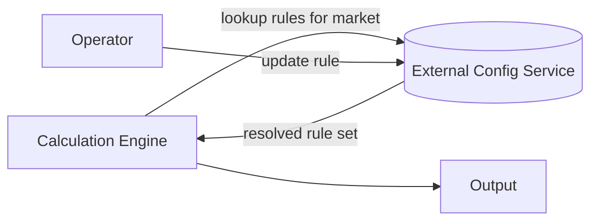

# Config-Driven Architecture: Externalizing Hardcoded Business Rules

A way to make a system's core business rules configurable per
market/business need, without a code deploy for every change, when the
system currently has those rules hardcoded directly in application code.

## Requirements

**Functional**
- An operator can change a business rule for one market without
  redeploying code.
- The system supports many rules, potentially with different values per
  market, without an explosion of conditional logic.
- Existing behavior must not change for any market during the
  migration — this is a refactor, not a behavior change.

*Below the line:* a UI for editing rules (a structured config
file/service is enough); rule versioning/rollback beyond what config
deployment already gives you.

**Non-functional**
- **Zero regression** — every market's actual computed output must
  match before and after the migration.
- Config changes should be fast to apply (minutes, not a deploy cycle)
  once the migration is complete.
- The system carries real technical debt (unused infrastructure, stale
  database state) that should get cleaned up as part of this.

*Below the line:* config change throughput — rule changes are
infrequent, operator-driven events, not a high-QPS path.

## Entities & API

**Entities**
- **Rule** — one business rule: which market(s) it applies to, its
  parameters, and which calculation it feeds into.
- **Rule Set** — the resolved collection of rules that apply to a given
  market at a point in time.

**API**
- `GET /rules?market={market}` — returns the resolved rule set for a
  market, used by the calculation engine at runtime.
- `PUT /rules/{ruleId}` — update a rule's parameters for a market (used
  by operators, not the hot calculation path).

## High-Level Design

**External configuration service** — *What:* a queryable store of
rules, keyed by market and rule type, read by the calculation engine
instead of the engine having values compiled in. *Why external rather
than a deploy-based config (a values file shipped with the code):* the
entire goal is decoupling a rule change from a code deploy — a file
shipped with the binary still requires a deploy to change.

**Calculation engine (unchanged logic, changed inputs)** — *What:* the
business logic keeps the same shape, but reads rule parameters from the
configuration service instead of having them as constants. *Why keep
the calculation logic itself unchanged during migration:* this is
explicitly a refactor with a zero-regression requirement — changing the
calculation and the rule source at the same time makes it much harder
to isolate which change caused a discrepancy if something breaks.

**Market as a config dimension, not a code branch** — *What:* instead
of `if market == X` branches, the engine looks up the resolved rule set
for whatever market it's processing. *Why:* with 15+ rules and multiple
markets, per-market code branches multiply combinatorially — a lookup
keyed by market scales by adding config, not code.

## Deep Dives

Why these three: the actual hard part of this migration isn't building
the config service — it's proving nothing changed, cleaning up what's
left behind, and not creating a new performance problem.

### 1. How do you prove the migration doesn't change any market's actual output?

**Simple approach:** migrate, deploy, watch for bug reports. Sufficient?
No — a subtle rule-resolution bug for a low-traffic market could go
unnoticed for a long time, and by then it's already produced wrong
output.

**Better approach:** run the new config-driven path and the old
hardcoded path side-by-side (shadow mode) for every market, diffing
outputs on real traffic before cutting over, and only migrate a market
once its shadow diff has been clean for a validation window.

**What I'd pick:** per-market shadow diffing as a hard gate before
cutover — given 15+ rules across multiple markets, the combinatorial
surface for a subtle mismatch is large enough that "watch for bug
reports" isn't an acceptable substitute for actually comparing outputs.

### 2. What do you do about accumulated technical debt uncovered during the migration?

(unused infrastructure, stale database state)

**Simple approach:** leave it alone, focus only on rule externalization.
Sufficient? Understandable given scope discipline, but this system was
already known to carry real debt, and touching the calculation engine
is exactly the moment you have the most context to identify what's
actually still used.

**Better approach:** use the same shadow-mode instrumentation from Dive
1 to also observe which existing infrastructure paths and database
records actually get touched by real traffic — anything with zero hits
during the validation window is a strong signal it's dead, not just
"probably unused."

**What I'd pick:** opportunistic cleanup validated by the same
instrumentation already being built for correctness — the marginal cost
is low since the observability is already there.

### 3. Does moving to runtime config lookups introduce a new performance problem?

**Simple approach:** call the configuration service on every
calculation. Sufficient? For infrequent calculations, yes — but on a
high-frequency path, a network call per calculation for a value that
changes rarely is unnecessary overhead.

**Better approach:** cache the resolved rule set with a short TTL or
explicit invalidation on config change, rather than a live call every
time — rule changes are infrequent, so a small amount of staleness
(seconds to low minutes) is an acceptable trade for removing a network
call from a potentially hot path.

**What I'd pick:** cache with invalidation over a live call per
calculation — the requirement was "minutes, not a deploy cycle" for
propagation speed, which a short-TTL cache satisfies without paying a
network call every time.

## Wrap-Up

Final flow: calculation engine reading a cached, invalidation-aware view
of an external rule configuration service, with the old hardcoded path
validated against it in shadow mode before any market cuts over.

With more time: build a lightweight UI for operators instead of direct
API calls; add rule-level audit history (who changed what, when); use
the technical-debt findings from Dive 2 to schedule a proper cleanup
pass rather than best-effort during the migration.
