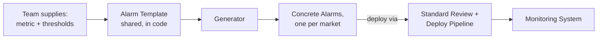

# Self-Service Infrastructure-as-Code Platform for Monitoring Alarms

A way to replace 100+ manually-created, inconsistent monitoring alarms
across many teams with a reusable, version-controlled, self-service
system — starting from one team's fix and scaling it org-wide.

## Requirements

**Functional**
- A team gets a full, consistent set of alarms for their metric across
  every market/region by supplying minimal configuration.
- Alarms are version-controlled and reviewable (a change goes through
  the same review process as a code change), not manually clicked
  together.
- Onboarding a new team shouldn't require the platform owner to write
  custom code per team.

*Below the line:* a UI for browsing alarm state (existing monitoring
tools already do this); custom alarm shapes beyond the shared template.

**Non-functional**
- **Consistency** — every team's alarms for the same underlying pattern
  (traffic drop, error-rate increase) should look the same, not vary by
  who happened to click them together.
- **Self-service** — a new team's onboarding effort should be config,
  not a request to the platform team to write code.
- **Reviewable and reversible** — an alarm change is a config change
  reviewed like code, with history, not a manual console edit with no
  audit trail.

*Below the line:* real-time alarm evaluation (the underlying monitoring
system's job — this system generates and manages alarm definitions).

## Entities & API

**Entities**
- **Alarm Template** — the shared, parameterized definition of one
  alarm shape (e.g. "traffic drop") used across every team.
- **Team Config** — one team's supplied values: which metric they
  track, and their per-market thresholds.
- **Generated Alarm** — the concrete, deployed alarm instance produced
  by combining a template with a team's config, per market.

**API**
This is infrastructure-as-code, not a runtime request/response API —
the "interface" is a config file format a team commits, processed by a
deployment pipeline rather than called at request time.

## High-Level Design

**Alarm template (defined in code)** — *What:* the shared shape of an
alarm — what condition it checks, parameterized by metric name and
per-market threshold, rather than a fully bespoke alarm per team. *Why
a shared template rather than each team owning their own definitions:*
the underlying alarm shapes are the same across teams — only the
specific metric and thresholds differ — so templating once avoids N
teams each reinventing the same logic slightly differently.

**Team config + generator** — *What:* a team supplies their tracked
metric name and a threshold per market; a generation step expands that
into the full set of concrete alarms, one per market, from the shared
template. *Why generate rather than have teams write one alarm per
market by hand:* with many markets, manual per-market creation is
exactly the error-prone, inconsistent process this replaces.

**Deployment pipeline** — *What:* a team's config change goes through
the same review-and-deploy pipeline as application code, rather than a
manual edit in a monitoring console. *Why:* manual console changes have
no review, no diff, and no audit trail — treating alarm config as code
gets you all three for free from infrastructure that likely already
exists for application code.

## Deep Dives

Why these three: the interesting problems in "turn 100+ ad-hoc alarms
into a shared platform" are proving the migration doesn't lose coverage,
getting other teams to actually adopt it, and keeping the template
flexible enough without over-fitting.

### 1. How do you migrate 100+ existing alarms without silently losing coverage?

**Simple approach:** turn off the old alarms and turn on the new
generated ones the same day. Sufficient? Risky — if the new template
doesn't perfectly replicate an old alarm's specific condition, there's
a gap where neither alarm correctly covers that case, undetected until
something goes unnoticed.

**Better approach:** run old and new alarms in parallel for a
validation window, comparing which one fires and when, and only
decommission an old alarm once its replacement has demonstrated
equivalent (or better) coverage.

**What I'd pick:** parallel running before decommissioning — for a
monitoring system specifically, "we assumed it was fine" is a bad
failure mode, since the entire point of an alarm is to be trustworthy
exactly when something's actually wrong.

### 2. How do you get other teams to adopt a platform built for your own team?

**Simple approach:** build it for your team, announce it's available,
wait for other teams to adopt. Sufficient? Rarely — a passive
announcement competes with every other team's backlog, and "it works
for us" isn't automatically convincing to a team with a
different-shaped problem.

**Better approach:** make onboarding cost close to zero by design (a new
team's actual work is just supplying their metric and thresholds), and
pair that with proactively approaching teams who have the same
underlying pattern rather than waiting for them to come looking.

**What I'd pick:** low onboarding cost as the actual adoption lever, not
the pitch — a platform is adopted because it's genuinely less work than
the status quo, and demonstrating that concretely is more persuasive
than describing it.

### 3. What happens when a team's alarm needs don't fit the shared template?

**Simple approach:** force every team into the same template regardless
of fit. Sufficient? No — either turns away teams with legitimately
different needs, or gets stretched with special-case parameters until
it's not really shared anymore.

**Better approach:** keep the template intentionally narrow (a small
number of well-defined alarm shapes that generalize well), and let a
team with a genuinely different need build outside the platform rather
than forcing a bad fit.

**What I'd pick:** a narrow, well-fitting template over a maximally
flexible one — a template that tries to do everything usually ends up
doing the common case worse in the name of accommodating edge cases a
small number of teams actually have.

## Wrap-Up

Final flow: shared template + team-supplied config → generated
per-market alarms → deployed through the same review pipeline as
application code, replacing the manual console-click process entirely.

With more time: build a lightweight self-service onboarding flow so a
team can add their config without platform-team involvement at all;
track adoption and coverage metrics org-wide to make the platform's
impact visible; consider a second template for teams whose needs
consistently don't fit the first, rather than stretching it.
