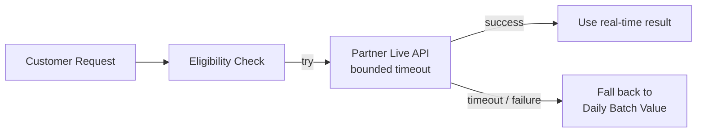

# Migrating a Daily Batch Refresh to Real-Time

> **Status: in-progress design, not yet built.** Unlike the other case
> studies in this repo, this one reflects a design still being worked
> through rather than a shipped system — included because the direction
> is settled even though some questions below are still open.

A way to replace a once-a-day batch refresh of a customer-facing
eligibility/availability status with a real-time check against a
partner's live API, without breaking the existing system during the
migration.

## Requirements

**Functional**
- A customer's eligibility/status reflects real-time state instead of
  being up to a day stale.
- The system keeps working correctly for the (likely large) share of
  traffic that doesn't need real-time freshness, without regressing
  existing behavior.
- **Fallback:** if the real-time check fails or times out, the system
  falls back to the existing daily-batch value rather than failing the
  request.

*Below the line:* real-time updates for every downstream consumer of
eligibility data — scope is the customer-facing check specifically.

**Non-functional**
- Added latency from a real-time check must stay within an acceptable
  bound for a customer-facing path — this can't turn a fast page load
  into a slow one.
- The partner's live API has its own rate limits and reliability
  characteristics this system doesn't control — the design has to
  assume it can be slow or unavailable sometimes.
- **Zero regression** for existing batch-refreshed behavior during the
  transition — this is additive, not a risky cutover.

## Input / Output & Data Flow

**Input:** a customer viewing a page where eligibility/offer
availability needs to be shown.

**Output:** an eligibility determination that's real-time-accurate when
possible, falling back to the existing daily-batch value when a live
check isn't possible in time.

Data flow (as currently being designed):
1. A request needing eligibility arrives.
2. The system checks whether a real-time check is needed/available for
   this case, and if so, calls the partner's live API with a bounded
   timeout.
3. If the live call succeeds within the timeout, use its result.
4. If it fails or times out, fall back to the existing daily-batch
   value.
5. **Open design question:** whether/how a successful live check also
   updates the daily-batch store, so subsequent requests benefit
   without needing another live call.

## High-Level Design (as currently scoped)

**Live API call with timeout + fallback** — *What:* on the
customer-facing path, attempt a live eligibility check against the
partner's API with a strict timeout; on any failure or timeout, use the
existing daily-batch value instead of failing the request. *Why
fallback rather than fail:* eligibility is supplementary information on
the page, not a hard blocker — a customer should still see the page
(with slightly stale data in the worst case) rather than an error
because a partner API was slow. *Why a strict timeout specifically:*
customer-facing latency has a hard ceiling regardless of what caused
the delay.

**Batch refresh stays the source of fallback truth** — *What:* the
existing daily-batch pipeline keeps running unchanged during the
transition, so the fallback path has a well-understood, already-trusted
value to fall back to. *Why not replace the batch system immediately:*
a phased approach (add real-time as a supplement, keep batch as the
safety net) is lower-risk than a hard cutover.

## Deep Dives (open design considerations)

These aren't resolved yet — this section reflects the trade-offs
currently being worked through rather than a settled answer.

### 1. How do you avoid the live API becoming a customer-facing latency/availability risk?

**Simple approach:** call it synchronously on every relevant page load
with a generous timeout. Risk: ties customer-facing page latency
directly to a third party's reliability, and a generous timeout makes
that risk worse, not better.

**Direction being considered:** a strict, short timeout with immediate
fallback (favoring "fast and possibly-stale" over "slow and
accurate"), plus treating repeated partner failures as a signal to
temporarily back off live calls entirely rather than retrying against a
struggling dependency.

### 2. Should a successful real-time check also update the batch-refreshed value?

**Simple approach:** treat every request independently — always try
live, always fall back to unmodified batch data if needed. Trade-off:
simplest to reason about, but means paying the live-call cost
repeatedly for the same customer within a short window instead of
caching the freshly-learned result.

**Direction being considered:** write a successful live result back
into the same store the batch job writes to, effectively giving that
customer a fresh value until the next batch run (or a short TTL). Open
question: whether that creates any inconsistency risk between
"batch-written" and "live-written" values that a downstream consumer
might handle differently.

### 3. How do you decide which traffic actually needs the real-time path?

**Simple approach:** apply real-time checking to all traffic uniformly.
Trade-off: unnecessary load on the partner API and unnecessary latency
risk for the (likely large) share of customers where a day-old value
was never actually going to be wrong for them.

**Direction being considered:** scope real-time checking to the cases
most likely to benefit — new customers, or customers whose eligibility
recently changed — rather than applying it universally, though the
exact scoping rule is still being defined.

## Wrap-Up (design status)

The core shape — a bounded live call with fallback to the existing
batch value — is settled. The write-back and traffic-scoping questions
above are open. Before calling this ready to build, I'd want those
resolved, plus a clear rollback story if the live path needs to be
disabled entirely.
