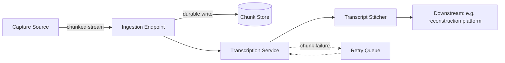

# Low-Latency Media Ingestion & Transcription Pipeline

> **Note on this one:** reconstructed from resume-level outcomes (a
> low-latency multimedia ingestion pipeline with AI-driven transcription,
> 99.99% availability, 40% latency reduction), not an original design
> doc. The problem and outcomes are real; the specific trade-off
> reasoning below is a plausible, standard treatment of this problem
> class rather than a transcript of the original decisions.

A low-latency pipeline for ingesting live multimedia streams and
producing accurate transcriptions in near real time, for a
mission-critical, customer-facing system.

## Requirements

**Functional**
- Ingest live (or near-live) multimedia streams as they're being
  captured.
- Produce a text transcription of the audio with low delay.
- Make ingested media and transcripts available to downstream
  consumers reliably.

*Below the line:* real-time multi-language translation; speaker
diarization beyond what's needed downstream.

**Non-functional**
- **99.99% availability** — a mission-critical path, not best-effort.
- **Low latency specifically on the voice-to-text step** — the known
  bottleneck being optimized.
- **Durable** — ingested media shouldn't be lost even if a downstream
  consumer is temporarily unavailable.

## Input / Output & Data Flow

**Input:** a live or near-live multimedia stream from a capture source.

**Output:** a durable copy of the ingested media, plus a text
transcript aligned to it, available to downstream systems with minimal
end-to-end delay.

1. Media arrives at an ingestion endpoint, chunked into small segments
   as it streams in — not buffered until the full recording completes.
2. Each chunk is durably stored as it arrives.
3. Chunks are fed to a transcription service incrementally, rather than
   waiting for the full stream.
4. Partial transcripts are stitched together and made available with
   low delay.
5. On transcription failure for a given chunk, the ingestion path isn't
   blocked — the failure is retried out of band.

## High-Level Design

**Chunked ingestion endpoint** — *What:* accepts media in small
time-boxed chunks as they're captured, rather than requiring the full
file upfront. *Why chunk rather than wait for a complete file:* waiting
puts a hard floor on latency equal to the recording's length — chunking
lets transcription start on the first few seconds while the rest is
still being captured.

**Durable per-chunk storage** — *What:* each chunk is persisted as it
arrives, independent of whether downstream processing has happened yet.
*Why:* decouples "did we receive it" from "did we finish processing
it" — a transcription failure shouldn't risk losing the underlying
media.

**Streaming/incremental transcription** — *What:* chunks are sent to
the transcription service as they arrive rather than batched into one
job at the end. *Why streaming over batch:* batch transcription only
starts after capture ends — exactly the latency this system is
optimizing against. *When batch is the simpler/better choice:* if the
source isn't actually live (already-recorded uploads), batch
transcription of the whole file skips the incremental-stitching
complexity for no latency cost.

**Transcript stitching** — *What:* partial transcripts from consecutive
chunks are combined into a continuous transcript, handling the boundary
between chunks explicitly. *Why this needs explicit handling:*
transcription models work on local context — chunk boundaries cut that
context off, so naive concatenation produces errors right at every
boundary.

## Deep Dives

Why these three: the interesting problems here are the latency/accuracy
trade-off at chunk boundaries, staying available when the transcription
dependency itself is degraded, and not losing media during a downstream
outage.

### 1. How small should chunks be, and what does that trade off?

**Simple approach:** very small chunks (sub-second) for minimum
latency. Sufficient? Latency-wise yes — but accuracy degrades with very
little context per chunk, and boundary-stitching errors get more
frequent the more boundaries there are.

**Better approach:** size chunks to balance the two — small enough to
bound latency, large enough for the model to have context — with slight
overlap between consecutive chunks so the stitcher has shared context
to reconcile boundary words instead of guessing. New problem:
overlapping chunks mean the same audio gets transcribed twice at the
seams — the stitcher needs a defined rule for which version wins.

**What I'd pick:** overlapping chunks with a defined
boundary-resolution rule (prefer the transcription with more
surrounding context) — non-overlapping chunks push the accuracy
trade-off to its worst point at exactly every boundary, which for a
transcription system is the wrong place to cut corners.

### 2. What happens when the transcription service itself is slow or degraded, not just a single chunk failing?

**Simple approach:** queue chunks and wait for the service to catch up.
Sufficient? For a brief blip, yes — but sustained degradation means the
queue grows and transcripts fall further behind real time, defeating
the point of a low-latency system.

**Better approach:** track a moving measure of transcription lag (not
just error rate), and once lag crosses a threshold, surface that
explicitly — mark transcripts as delayed — rather than silently
continuing to queue.

**What I'd pick:** an explicit lag signal exposed to downstream
consumers rather than a silently growing queue — for a mission-critical
system, knowing "this is currently delayed" is more useful than
assuming real-time when it's actually far behind.

### 3. How do you guarantee ingested media isn't lost if a downstream consumer is temporarily unavailable?

**Simple approach:** push media directly to the downstream consumer as
it's ingested, no intermediate durable store. Sufficient? No — if the
consumer is down when a chunk arrives, that chunk is gone unless
ingestion is durable independent of whether anyone's currently
listening.

**Better approach:** the chunk store from the high-level design is the
answer — ingestion writes durably first, downstream consumption reads
from that store rather than being pushed to directly.

**What I'd pick:** durable-write-then-consume over direct push — the
same decouple-produce-from-consume principle that shows up across this
repo, because it's what actually makes zero data loss possible under
any single component's downtime.

## Wrap-Up

Final flow: chunked ingestion writing durably first, streaming
transcription with overlapping chunks feeding a boundary-aware
stitcher, an explicit lag signal when the transcription service is
degraded, and a retry path for individual chunk failures that doesn't
block the rest of the stream.

With more time: add speaker-level segmentation if downstream consumers
need to attribute text to a specific speaker; explore whether a
lighter, faster "draft" pass could give consumers something immediately
while a slower, more accurate pass reconciles it afterward; formalize
what "acceptable lag" means per consumer, since different downstream
uses likely have different tolerance.
