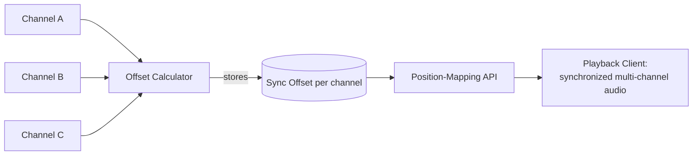

# Multi-Channel Audio Synchronization for Incident Reconstruction

> **Note on this one:** reconstructed from resume-level outcomes
> (backend services letting investigators synchronize and replay
> parallel audio channels, 25% reduction in review time), not an
> original design doc. The problem and outcomes are real; the specific
> trade-off reasoning below is a plausible, standard treatment rather
> than a transcript of the original decisions.

Backend services that let an investigator reconstruct an incident by
synchronizing and replaying multiple parallel audio channels together,
reducing the manual work of piecing together a timeline.

## Requirements

**Functional**
- An investigator can select an incident and see/hear multiple audio
  channels played back in sync with each other.
- The system supports channels that didn't start recording at exactly
  the same moment, possibly on different clocks.
- An investigator can seek to any point in the incident timeline and
  have every channel jump to the corresponding synchronized position.

*Below the line:* real-time collaborative review; automatic incident
summarization.

**Non-functional**
- **Playback synchronization has to be tight enough that a human
  listening across channels doesn't perceive drift** — this is the core
  value proposition.
- Should reduce, not just relocate, manual effort — the point is less
  time spent on the mechanical part of lining channels up.
- Read-heavy, replay-focused workload — investigators consume existing
  recordings, not generate new real-time data through this system.

## Entities & API

**Entities**
- **Incident** — a logical grouping of multiple channels believed to
  relate to the same event.
- **Channel** — one audio recording, with its own start time and
  duration, associated with an incident.
- **Sync Offset** — the computed time offset needed to align one
  channel against a chosen reference channel.

**API**
- `GET /incidents/{id}/channels` — list channels for an incident, with
  their computed sync offsets.
- `GET /incidents/{id}/playback?position={t}` — given a position on the
  reference timeline, returns the corresponding position for every
  channel.

## High-Level Design

**Incident grouping** — *What:* channels believed to relate to the same
event are associated together, likely via metadata available at
capture time (time window, location) or an explicit manual link. *Why
not fully automatic:* without more signal than "happened around the
same time," automatically grouping channels risks false groupings — a
human decision is safer than a fully automated one for something
investigators rely on.

**Offset calculation** — *What:* for each channel in an incident,
compute the time offset needed to align it against a reference channel,
and store that offset rather than recomputing it on every playback
request. *Why compute once and store:* alignment can involve
non-trivial signal comparison — doing that per request would make
seeking slow.

**Position-mapping API** — *What:* given a position on the reference
channel's timeline, look up each other channel's stored offset and
return the corresponding position. *Why keep this a simple lookup
rather than embedding alignment logic in every client:* clients
shouldn't need to know how alignment was computed — just "given time T
on the reference, what's the matching time on channel X," a cheap
stateless lookup once offsets exist.

## Deep Dives

Why these three: the core hard problem is computing an accurate offset
between channels that didn't start recording together, keeping that
alignment correct over the whole duration, and making sure a wrong
incident grouping doesn't quietly produce a misleading reconstruction.

### 1. How do you compute an accurate offset between channels on different clocks?

**Simple approach:** trust each channel's recorded start timestamp and
align by simple subtraction. Sufficient? Only if every capture device's
clock is perfectly synchronized — in practice, clock drift makes
timestamp-based alignment unreliable by exactly the amount of drift,
which for audio can be very perceptible even at small offsets.

**Better approach:** use content-based alignment — compare the actual
audio signal between channels (e.g. cross-correlation) to find the
offset that best matches shared audio content, rather than trusting
metadata timestamps. New problem: content-based alignment only works if
channels actually share correlated signal; if two channels share no
common signal, there's nothing to correlate against.

**What I'd pick:** content-based alignment as the primary method with
timestamp alignment as an explicit fallback when correlation confidence
is too low — and surface which method was used, since an investigator
relying on a low-confidence fallback should know that's what they're
getting.

### 2. Does an offset computed once at the start stay accurate for the whole recording?

**Simple approach:** compute one fixed offset and apply it uniformly.
Sufficient? For stable, consistent-rate hardware, usually yes — but if
a device's recording rate drifts even slightly over a long recording, a
fixed offset accurate at the start slowly becomes wrong by the end.

**Better approach:** validate alignment at multiple points across the
recording, not just once at the start, and detect if the offset needs
to vary over time (indicating clock drift rather than a fixed
start-time difference) — if so, use a time-varying offset.

**What I'd pick:** multi-point validation as a check, with a
time-varying offset only where drift is actually detected — assuming
drift by default adds complexity for channels that don't need it.

### 3. How do you keep a wrong incident grouping from quietly producing a misleading reconstruction?

**Simple approach:** once channels are grouped, present them as
synchronized without further indication of confidence. Sufficient? No —
if the grouping was wrong, a confident-looking synchronized playback is
actively misleading to an investigator relying on it.

**Better approach:** surface alignment confidence alongside playback —
a strong content-based match shown as such; a fallback to timestamp
alignment or a weak correlation flagged explicitly rather than
presented with the same apparent confidence.

**What I'd pick:** visible confidence indicators tied to how the offset
was actually computed — for a tool whose output investigators act on,
being clear about uncertainty is worth more than always appearing
confident.

## Wrap-Up

Final flow: content-based offset calculation (with timestamp fallback)
computed once per channel and stored, a simple position-mapping lookup
serving playback requests, with confidence indicators surfaced wherever
the alignment is less certain than a strong content match.

With more time: add multi-point drift detection as a default check
rather than an escalation path; let an investigator manually nudge an
offset if they spot a small misalignment the automated method missed,
and feed that correction back to improve future confidence scoring;
look at whether incident grouping itself could be assisted by the same
content-correlation signal used for alignment.
