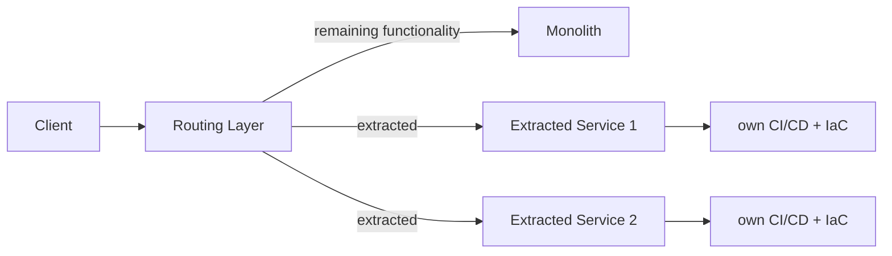

# Incremental Monolith-to-Microservices Migration on AWS

> **Note on this one:** reconstructed from resume-level outcomes
> (migrating legacy on-prem monoliths to modular AWS microservices via
> CDK and CI/CD, -35% infrastructure overhead, +43% faster releases),
> not an original design doc. The problem and outcomes are real; the
> specific trade-off reasoning below is a plausible, standard treatment
> rather than a transcript of the original decisions.

A migration path for moving a legacy, on-premises monolithic
application to a modular, cloud-native microservices architecture on
AWS, without a risky big-bang cutover.

## Requirements

**Functional**
- Existing functionality keeps working throughout the migration — this
  is a migration, not a rewrite-and-hope.
- New/modified functionality can be built as independently deployable
  services going forward, rather than added to the monolith.
- Infrastructure is defined and deployed as code, not manually
  provisioned.

*Below the line:* a full rewrite of business logic; data migration
strategy beyond what's needed to support the split.

**Non-functional**
- **Zero or minimal, well-communicated downtime** during the
  transition — a live application, not one with a convenient
  maintenance window for a big-bang cutover.
- **Infrastructure overhead should go down**, not up, as a result of
  the migration — the on-prem footprint carried real fixed cost a
  right-sized, cloud-native approach removes.
- **Release velocity should go up** — implies the monolith's deploy
  process was itself a bottleneck, independent of infrastructure cost.

## Migration Approach

Rather than entities/API, this is naturally phased, like a rollout:

1. Identify a boundary and extract the first service, running alongside
   the monolith.
2. Route a slice of real traffic to the new service, with the monolith
   as fallback.
3. Repeat the extraction pattern for additional boundaries,
   independently.
4. Decommission the corresponding monolith code path once its
   extracted service is fully trusted.

## High-Level Design

**Strangler pattern** — *What:* new functionality (and selected
existing functionality) is built as a separate service sitting
alongside the monolith, with a routing layer deciding which system
handles a given request, rather than rewriting the monolith wholesale.
*Why strangler over big-bang rewrite:* a big-bang rewrite doesn't earn
any trust until the entire thing is done and cut over at once — high
risk for a live application. The strangler approach lets each extracted
piece prove itself independently. *When big-bang might make sense
instead:* if the monolith were small enough, or already scheduled for
full replacement regardless, incremental extraction adds coordination
overhead a full rewrite wouldn't need.

**Routing layer** — *What:* sits in front of both the monolith and the
new services, directing each request to whichever system currently owns
that functionality. *Why a routing layer rather than pointing clients
directly at the new service once it exists:* "which system owns this"
changes over time as more gets extracted — a routing layer makes that a
config change, not a client-side change every time a boundary moves.

**Modular service + infrastructure-as-code** — *What:* each extracted
piece is deployed as its own independently-releasable unit, with
infrastructure defined in code rather than manually provisioned. *Why
infrastructure-as-code specifically:* faster release cycles depend on
removing manual provisioning as a bottleneck — infrastructure changes
need to ship as fast as code changes.

**CI/CD pipeline per service** — *What:* each service gets its own
build/deploy pipeline, decoupled from the monolith's release process.
*Why decouple release cycles:* a classic monolith cost is that any
change, however small, requires deploying (and re-validating) the
entire application — separate pipelines mean a change to one extracted
service doesn't require redeploying everything else.

## Deep Dives

Why these three: the interesting problems here are choosing which
boundary to extract first, proving a cutover is safe without a
maintenance window, and not letting the migration itself become the new
bottleneck.

### 1. How do you decide which piece of the monolith to extract first?

**Simple approach:** extract whatever's easiest to separate
technically. Sufficient? Gets something shipped, but "easiest" and
"most valuable" aren't the same — early effort can go to a low-impact
piece while the actual bottleneck stays untouched.

**Better approach:** prioritize by a combination of extraction
difficulty and expected impact — pieces that are both frequently
changed (extraction directly speeds up future releases) and cleanly
bounded (lower extraction risk) go first; rarely-touched pieces can stay
in the monolith longer without cost.

**What I'd pick:** impact-weighted prioritization over "easiest
first" — given the goal was measurably faster releases and lower
overhead, extraction order should be chosen to hit those goals early,
not just to bank easy technical wins.

### 2. How do you validate a cutover is safe without a maintenance window?

**Simple approach:** cut traffic over to the new service all at once
and watch for errors. Sufficient? Risky — by the time errors are
visible, real traffic has already hit a possibly-broken path, exactly
what "minimal downtime" was meant to avoid.

**Better approach:** route a small percentage of real traffic to the
new service first, monolith still handling the rest as an immediate
fallback, comparing outcomes (error rates, latency, output correctness)
before increasing the new service's share. Same shape as the phased,
switch-controlled rollout used elsewhere in this repo — gradual,
monitored, reversible via the routing layer rather than a redeploy.

**What I'd pick:** gradual traffic shift with the routing layer as the
reversibility mechanism — instant rollback (route back to the monolith)
is far cheaper than an emergency redeploy of a failed big-bang cutover.

### 3. How do you keep the migration itself from becoming a new bottleneck?

**Simple approach:** work through extraction sequentially, one piece
fully done before starting the next. Sufficient? Easy to manage, but
means most of the expected benefit doesn't materialize until the whole
migration is far along.

**Better approach:** once the routing layer and strangler pattern are
established as reusable infrastructure, multiple boundaries can be
extracted in parallel, since each extraction is largely independent
once the pattern is proven — the first extraction costs the most
(establishing the pattern), subsequent ones are cheaper.

**What I'd pick:** sequential for the first extraction (to prove and
refine the pattern), parallelized afterward — treating the first
extraction as paying down setup cost that makes every subsequent one
faster.

## Wrap-Up

Final flow: a routing layer in front of the monolith and each extracted
service, each service independently deployed via its own CI/CD pipeline
and infrastructure-as-code, cutovers validated with gradual traffic
shifting and instant rollback via the routing layer rather than a
redeploy.

With more time: formalize the impact-weighted prioritization from Dive
1 into an actual scoring method rather than a judgment call; build
shared tooling/templates for the CI/CD-and-infra-as-code pattern so
each new extraction reuses setup; track infrastructure cost and release
velocity per extracted service to make the migration's impact visible
incrementally, not just at the end.
